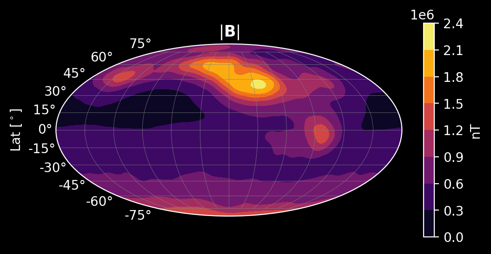
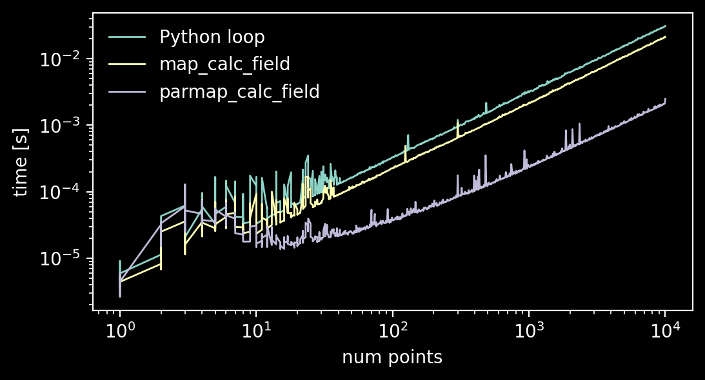
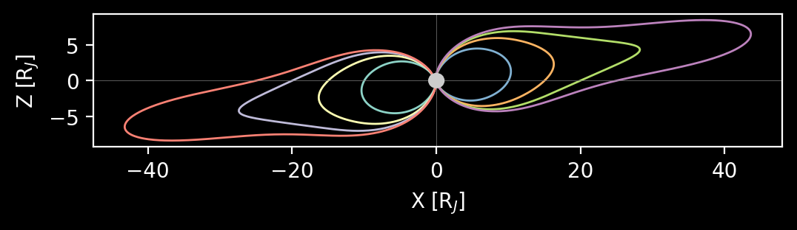

# iupitermag

## Introduction 

iupitermag is a [Python](https://www.python.org/) package written in
[Rust](https://www.rust-lang.org/)
to model Jupiter's magnetic field. 



*Jupiter's internal magnetic field intensity at the 1-bar "surface".*

Many **other public codes** do this or something similar,

* [`JupiterMag`](https://github.com/mattkjames7/JupiterMag) - 
  A Python package that uses the 
  [`libjupitermag`](https://github.com/mattkjames7/libjupitermag) 
  C++ library (both written by Matt James).
* [`jovian_jrm09_internal`](https://github.com/marissav06/jovian_jrm09_internal_matlab), 
  [`con_2020`](https://github.com/marissav06/con2020_matlab) - Codes written for MATLAB and IDL by Marrisa Vogt. 
* [`con2020`](https://github.com/gabbyprovan/con2020) - Python code by Gabby Provan.

> More details on Jupiter magnetic field models and these codes 
> can be found in this paper - Wilson, R.J., Vogt, M.F., Provan, G. et al. **Internal and External Jovian 
> Magnetic Fields: Community Code to Serve the Magnetospheres of the Outer Planets
> Community.** Space Sci Rev 219, 15 (2023). 
> [https://doi.org/10.1007/s11214-023-00961-3](https://doi.org/10.1007/s11214-023-00961-3)

## Usage

### Installing from source using `uv`

If you are using `uv` as your Python package manager, you can run the following commands after 
cloning and changing into this directory.

```
$ uv pip install .
```

### Calculating the internal and current sheet fields at a single point.

All positions should be in the IAU_JUPITER coordinate system.

```python
import iupitermag as im

internal_field = im.InternalField("JRM33")
cs_field = im.CurrentSheetField("CON2020")

r = 10.
theta = 0.
phi = 0.
b_int_rtp = internal_field.calc_field(r, theta, phi)
b_ext_rtp = cs_field.calc_field(r, theta, phi)

# Or, you can the cartesian form.  This calls the spherical version internally.
x = 10.
y = 5.
z = 1.
b_int_xyz = internal_field.calc_field_xyz(x, y, z)
b_ext_xyz = cs_field.calc_field_xyz(x, y, z)

```

### Calculating the internal and current sheet fields for a collection of points.

If you have a collection of points stored as a single numpy array of shape (N, 3), 
you can use `map_calc_field` or `parmap_calc_field` (or their corresponding 
cartesian versions `map_calc_field_xyz` and `parmap_calc_field_xyz`).

```python
points = np.zeros((10000, 3))
points[:, 0] = np.random.random_sample((10000,)) * 10 + 5

b_int = internal_field.map_calc_field(points)
b_ext = cs_field.map_calc_field(points)

b_int = internal_field.parmap_calc_field(points)
b_ext = cs_field.parmap_calc_field(points)

points_xyz = points * 1.

b_int_xyz = internal_field.map_calc_field_xyz(points_xyz)
b_ext_xyz = cs_field.map_calc_field_xyz(point_xyz)

b_int_xyz = internal_field.parmap_calc_field_xyz(points_xyz)
b_ext_xyz = cs_field.parmap_calc_field_xyz(points_xyz)
```

Based on some benchmarks, you should find `parmap_calc_field` nearly an order of magnitude
faster than `map_calc_field` or a Python loop over all points calling `calc_field`
repeatedly.  `parmap_*` uses Rayon for parallelizing the calculation.  Here are the results of 
benchmarking different methods to calculate the JRM33 field for different number of points.



As you can see, `parmap_` is usually the better option if you have more than 20 or so points. Note
that the Python loop version still calls the Rust code internally to calculate the JRM33 field, so
even that is faster than a pure-Python implementation (not shown above).

### Tracing magnetic field lines

`iupitermag` can trace magnetic field lines to Jupiter using `trace_field_to_planet`, which takes 
as input a collection of starting points (which each result in a separate trace).  The coordinates 
for these starting points should be cartesian.

```python
internal_field = im.InternalField("JRM33")
cs_field = im.CurrentSheetField("CON2020")

starting_positions_xyz = np.array([
    [-10., 0., 0.],
    [-15., 0., 0.],
    [-20., 0., 0.],
    [-25., 0., 0.],
    [10., 0., 0.],
    [15., 0., 0.],
    [20., 0., 0.],
    [25., 0., 0.],
])

trace = im.trace_field_to_planet(starting_positions_xyz, internal_field, cs_field)
```


