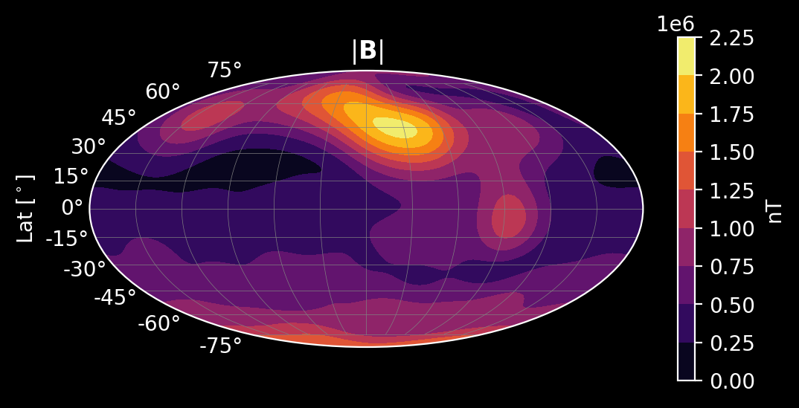

# iupitermag

## Introduction 

iupitermag is a [Python](https://www.python.org/) package written in
[Rust](https://www.rust-lang.org/)
to model Jupiter's magnetic field. 

*Jupiter's internal magnetic field intensity at the 1-bar "surface".*

Many **other public codes** do this or something similar,

* [`JupiterMag`](https://github.com/mattkjames7/JupiterMag) - 
  A Python package that uses the 
  [`libjupitermag`](https://github.com/mattkjames7/libjupitermag) 
  C++ library (both written by Matt James).
* [`jovian_jrm09_internal`](https://github.com/marissav06/jovian_jrm09_internal_matlab), 
  [`con_2020`](https://github.com/marissav06/con2020_matlab) - Codes written for MATLAB and IDL by Marrisa Vogt. 
* [`con2020`](https://github.com/gabbyprovan/con2020) - Python code by Gabby Provan.

> More details on Jupiter magnetic field models and these codes 
> can be found in this paper - Wilson, R.J., Vogt, M.F., Provan, G. et al. **Internal and External Jovian 
> Magnetic Fields: Community Code to Serve the Magnetospheres of the Outer Planets
> Community.** Space Sci Rev 219, 15 (2023). 
> [https://doi.org/10.1007/s11214-023-00961-3](https://doi.org/10.1007/s11214-023-00961-3)

# Latest Issues
The CON2020 current sheet calculation is currently bugged.

