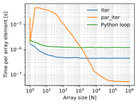

## Benchmarking

In general, for each field type, `iupitermag` has the following methods:  

1. `calc_field` - which takes as input spherical coordinates of one point.
2. `map_calc_field` - which takes as input a 2D array of shape `(nPoints, 3)`.
3. `parmap_calc_field` - which is similar to `map_calc_field` except that it uses
  [`rayon`](https://github.com/rayon-rs/rayon) to do the calculation in parallel
  using multiple threads.

Below I show how these methods compare to each other for arrays for 
different values of `nPoints` (or N). This benchmarking is done in Python using
the same array of all three methods. For `calc_field` I pass the coordinates of 
each point via a Python loop, but the calculation itself is done in Rust.

Here are the results showing the execution time **per array element**,

If the number of points is less than ~1000, the `iter()` approach as used by 
`map_calc_field` is the fastest. Python loops are in general slower than 
`map_calc_field` for all array sizes.  

The `par_iter()` approach using `rayon` performs (much!) worse than `iter()` 
when the number of points is less than ~2000. But, for larger arrays with 
100000 points or more, it is almost an order of magnitude faster. I am not sure 
why the performance using `rayon` is so bad for smaller arrays;
perhaps this requires additional investigation.  

So the takeaway from these tests is to use `map_calc_field` for smaller number 
of points and `parmap_calc_field` for larger arrays (N > 1000).